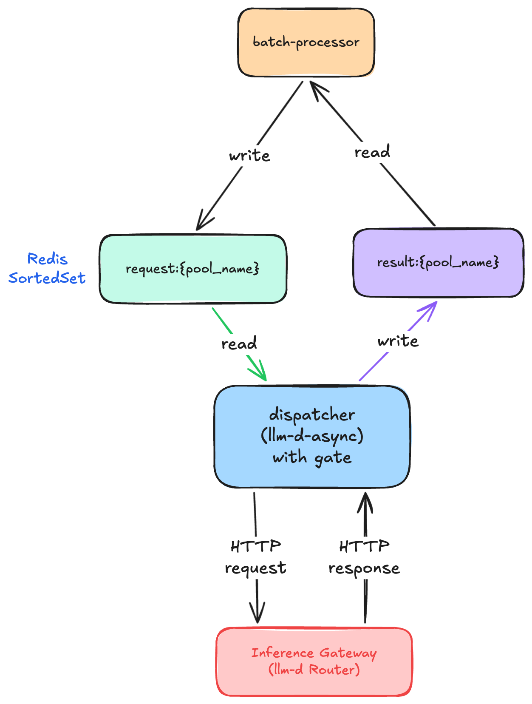

# Batch Dispatcher Queue Design

-   **Revision**: 2
-   **Last Updated**: 2026-05-12
-   **Related Jira**: [INFERENG-5607](https://redhat.atlassian.net/browse/INFERENG-5607)

Related:
- [Batch Dispatcher](batch-dispatcher.md)
- [Batch Dispatcher — Gating Logic and Flow Control](batch-dispatcher-detailed-ASYNC-REPO.md)
- [Dispatch Budget](https://github.com/llm-d-incubation/llm-d-async/blob/main/docs/dispatch-budget.md) (llm-d-async)
- [Batch Processor Design](batch_processor_architecture.md)
- [Batch Inference Architecture](batch_inference_architecture.md)

---

## Summary

This document describes the design of the request and result queues that connect the **batch-processor** to the **batch dispatcher** ([llm-d-async](https://github.com/llm-d-incubation/llm-d-async)). At this time we always assume that each target inference pool corresponds to a single connector. In other words, we assume that there will never be 2 queues targeting the same inference pool at once; we reserve this for future extensions, if needed. Multi-model batch jobs (where a single job targets models in different inference pools) are also out of scope; the executor would need to enqueue into multiple queues and the consumer would need to read from multiple result queues, which adds complexity deferred to a future iteration.

This design document describes the integration of the batch dispatcher with the batch processor. When
the batch dispatcher is available and properly configured, the batch-processor's executor will not dispatch inference requests directly to the inference gateway via HTTP; instead it enqueues individual requests into **the dispatcher's request queue**; **the dispatcher pulls and forwards** them to the inference gateway based on the [dispatch budget](https://github.com/llm-d-incubation/llm-d-async/blob/main/docs/dispatch-budget.md). A **result consumer** in the batch-processor reads completed responses from **the dispatcher's result queue** and routes them back to the appropriate job's output writer.

This document uses **producer** and **consumer** from the batch-processor's perspective, consistent with the batch-gateway codebase (cf. `ECProducerSendEvents`, `ECConsumerGetChannel`). The batch-processor is the **producer** of the request queue and the **consumer** of the result queue.

---

## Problem Statement

The batch-processor currently sends requests directly to the inference gateway with no awareness of inference pool saturation beyond HTTP 429 backpressure and AIMD-based concurrency control. This reactive approach has limitations:

- **Late feedback**: The processor only learns about overload after sending a request and getting a 429, wasting a round-trip and consuming gateway resources.
- **No coordination with online traffic**: The processor cannot preemptively yield capacity to interactive requests — it reacts only after the gateway is already saturated.
- **No cross-processor coordination**: Multiple batch-processor replicas independently manage their own concurrency limits without a shared view of system load.

The dispatcher solves these by acting as a system-load-aware gatekeeper that meters batch requests into the gateway based on real-time Prometheus metrics (EPP fullness, vLLM saturation).

---

## Architecture



---

## Queue Naming Convention

Queue names follow a fixed convention keyed by the inference pool name:

| Queue | Redis Type | Name Pattern | Example |
|-------|-----------|--------------|---------|
| Request queue | Sorted Set | `request:{pool_name}` | `request:optimized-baseline` |
| Result queue | List | `result:{pool_name}` | `result:optimized-baseline` |

The `pool_name` corresponds to the target [InferencePool](https://gateway-api-inference-extension.sigs.k8s.io/api-types/inferencepool/). Both the batch-processor and the dispatcher are configured with the pool name they operate on, and derive queue names deterministically from it.

When the dispatcher is used, the inference gateway endpoint configuration lives entirely on the dispatcher side: the batch-processor does not need to know about gateway URLs, TLS settings, or routing modes. The batch-processor only needs the pool name, the connector type, and the connector endpoint.

### Batch-Processor Configuration (strawman)

The batch-processor config gains a `dispatcher` section. When present, the executor enqueues to the request queue instead of dispatching directly. The `global_inference_gateway` / `model_gateways` sections are not needed when the dispatcher is used.

```yaml
# Dispatcher integration (replaces direct inference gateway dispatch)
dispatcher:
  pool_name: "optimized-baseline"       # derives queue names: request:{pool_name}, result:{pool_name}
  connector:
    type: redis                          # queue backend (currently only redis)
    url: "redis://redis-master:6379"
```

### Dispatcher Configuration

The dispatcher (llm-d-async) already supports the Redis sorted-set flow with dispatch budget gating. It is deployed via Helm; the relevant values for queue names, inference gateway endpoint, and gating are:

```yaml
ap:
  igwBaseURL: "http://llm-d-inference-gateway-istio:80"
  messageQueueImpl: "redis-sortedset"
  concurrency: 4
  prometheusURL: "http://prometheus.monitoring.svc:9090"
  redis:
    url: "redis://redis-master.redis.svc:6379"
    requestQueueName: "request:optimized-baseline"
    resultQueueName: "result:optimized-baseline"
    pollIntervalMs: 1000
    batchSize: 10
    gateType: "prometheus-budget"
    gateParams:
      pool: "optimized-baseline"
      max_concurrency: "100"
      baseline: "0.05"
```

The dispatcher pulls up to `batchSize × (D − B)` requests per poll cycle and forwards them to the inference gateway. Results are written to the result queue. See the [llm-d-async README](https://github.com/llm-d-incubation/llm-d-async/blob/main/README.md) and [Helm chart values](https://github.com/llm-d-incubation/llm-d-async/tree/main/charts/async-processor) for the full configuration.

### Future Extension: Queue Registry

For deployments where queue names need to be decoupled from pool names (e.g., migrations, multi-tenant namespacing), a registry-based approach could be introduced:

- A shared ConfigMap, Redis hash, or CRD maps `pool_name → {request_queue, result_queue}`.
- Both the batch-processor and dispatcher resolve queue names dynamically from the registry, allowing queue mappings to change at runtime without restarting either side.

This is not needed for the 1:1 topology and is deferred to a future iteration.

---

## Request Queue

For a given inference pool, the batch-processor **produces** requests into the dispatcher's **request queue** for that pool; the dispatcher reads from it, gated by the dispatch budget.

Note: The request queue is currently implemented by a **Redis SortedSet** that holds individual inference requests awaiting dispatch.

### Why the Producer Can Enqueue Liberally

Unlike direct dispatch to the inference gateway — where the EPP's flow control limits how many requests can be in-flight and excess requests are rejected with HTTP 429 — **the request queue is a passive buffer with no backpressure on writes**. The producer can enqueue requests as fast as it can read plan entries, without throttling or semaphore gating. This is safe because:

1. **Flow control is deferred to the dispatcher.** The [dispatch budget](https://github.com/llm-d-incubation/llm-d-async/blob/main/docs/dispatch-budget.md) gates how many requests leave the queue per cycle (`N = max_SYS × (D − B)`). Enqueuing more requests than the dispatcher can immediately process simply means they wait in the queue until capacity opens up — they do not reach the inference gateway or compete with online traffic.

2. **The queue is cheap storage.** Redis sorted sets are memory-efficient for this workload. Each request message is a few KB; even a full 50,000-request batch job at ~2 KB per message is ~100 MB — well within Redis capacity and far cheaper than holding in-flight HTTP connections.

3. **Deadline ordering is automatic.** Because the sorted-set score is the SLO deadline, enqueuing all requests upfront means the dispatcher always picks the most urgent request across all active jobs. Throttling the enqueue rate would artificially delay requests and could cause the dispatcher to miss tighter deadlines that haven't been enqueued yet.

4. **No wasted round-trips.** With direct dispatch, a 429 response wastes a full HTTP round-trip and consumes gateway resources (connection handling, flow control evaluation). With queue-based dispatch, the request sits in Redis until the dispatcher determines it's safe to forward.

### Message Format

Request messages follow the wire format defined in the [llm-d-async README — Request Messages and Consumption](https://github.com/llm-d-incubation/llm-d-async/blob/main/README.md#request-messages-and-consumption). The `metadata` field carries batch-processor correlation data (`job_id`, `request_index`) that the dispatcher passes through opaquely and returns in the result. The `headers` field can carry HTTP headers that the dispatcher forwards to the inference gateway (e.g., fairness/SLO headers that the current executor attaches directly).

The sorted-set score is the request's SLO deadline (Unix timestamp), so earliest-deadline requests are dispatched first across all jobs sharing the same pool — providing cross-job deadline-aware scheduling.

**Example:**

```json
{
  "id": "batch_req_xyz",
  "created": 1700000000,
  "deadline": 1700086400,
  "payload": {
    "model": "Qwen/Qwen3-0.6B",
    "messages": [{"role": "user", "content": "What is 2+2?"}],
    "max_tokens": 128
  },
  "metadata": {
    "job_id": "batch_abc123",
    "request_index": "42"
  }
}
```

### Producer (Batch-Processor)

The executor currently dispatches requests by acquiring semaphores and then forwarding the request directly. With the dispatcher integration, the executor instead:

1. Reads the plan entry and the corresponding input line.
2. Constructs a request message with the SLO deadline, request payload, correlation `metadata` (`job_id`, `request_index`), and any pass-through `headers` (e.g., fairness/SLO headers).
3. Enqueues the request into the `request:{pool_name}` queue with the SLO deadline.

As described above, the producer does not need to throttle enqueue operations. The per-endpoint and global semaphores are no longer needed, the dispatcher's dispatch budget handles flow control downstream.

### Dispatcher (reads from request queue)

The dispatcher ([llm-d-async](https://github.com/llm-d-incubation/llm-d-async)) periodically polls the sorted set. On each cycle, it computes the budget on its "Dispatch Gate" to determine the current dispatch budget $D$. If $D > B$ (the reserved baseline), it pops up to `batchSize × (D − B)` requests (lowest score = earliest deadline first) and forwards them to the inference gateway via HTTP. See [Dispatch Budget](https://github.com/llm-d-incubation/llm-d-async/blob/main/docs/dispatch-budget.md) for the full gating logic.

The dispatcher requires no changes to support this integration, it already implements the Redis sorted-set flow with dispatch budget gating. Only the queue names need to match the naming convention.

---

## Result Queue

The result queue holds completed inference responses. The dispatcher writes results into this queue after receiving responses from the inference gateway; the batch-processor **consumes** results and routes them back to the appropriate job's output writer.

Note: the result queue is currently implemented by a Redis list.

### Message Format

Result messages follow the format defined in the [llm-d-async README — Results](https://github.com/llm-d-incubation/llm-d-async/blob/main/README.md#results). The `metadata` from the original request (containing `job_id` and `request_index`) is passed through by the dispatcher, allowing the consumer to route results back to the correct job.

**Example:**

```json
{
  "id": "batch_req_xyz",
  "payload": "{\"id\":\"chatcmpl-...\",\"object\":\"chat.completion\",\"model\":\"Qwen/Qwen3-0.6B\",\"choices\":[...]}",
  "metadata": {
    "job_id": "batch_abc123",
    "request_index": "42"
  }
}
```

### Dispatcher (writes to result queue)

After the dispatcher receives a response from the inference gateway (success or failure), it writes the result to `result:{pool_name}`. The `metadata` from the original request is carried through so the consumer can route the result.

### Consumer (Batch-Processor)

A new component in the batch-processor consumes results from `result:{pool_name}`:

1. Polls the result list.
2. For each result message, looks up the job by `job_id` to find the active job's output writer.
3. Writes the response to `output.jsonl` (on success) or `error.jsonl` (on failure), following the same logic as the current executor.
4. Updates progress counters and metrics.

The consumer runs as a separate goroutine (or pool of goroutines) alongside the executor. It must handle:

- **Job not found**: The job may have been cancelled or expired between dispatch and result arrival. Log and discard the result.
- **Duplicate results**: Idempotency — if a result for the same `(job_id, request_index)` has already been written, skip it.
- **Ordering**: Results arrive out of order (the dispatcher processes requests concurrently). This is fine — the current executor already writes results out of order via concurrent goroutines.

---

## Job Lifecycle Impact

- **Ingestion**: Unchanged — the preprocessor still builds per-model plan files.
- **Execution**: The executor enqueues all plan entries into the request queue and then waits for results via the consumer. A job is "execution complete" when all expected results have been received (or the SLO/cancel deadline fires).
- **Finalization**: Unchanged — output files are uploaded to shared storage.
- **Cancellation / SLO expiry**: When a job is cancelled or expires, the batch-processor must remove any pending (not-yet-dispatched) requests from the request queue. This requires tracking which requests have been enqueued but not yet completed.

### Concurrency Control Interaction

With the dispatcher handling flow control, the batch-processor's concurrency model simplifies:

| Concern | Current (direct dispatch) | With dispatcher |
|---------|--------------------------|-----------------|
| Inference pool saturation | AIMD on 429/5xx (reactive) | Dispatch budget (proactive) |
| Per-endpoint concurrency | Adaptive semaphore | Dispatcher gates per pool |
| Global concurrency | Fixed semaphore | Not needed — queue is a passive buffer |
| Cross-processor coordination | None | Shared queue + single dispatcher |

The AIMD controller and semaphores in the batch-processor become redundant for gating purposes, since the dispatcher gates requests before they reach the inference gateway. The batch-processor's role shifts from "rate-limited sender" to "enqueuer + result collector."

---

## Open Questions

1. **Request cancellation**: When a job is cancelled, how do we efficiently remove its pending requests from the sorted set? Options:
   - Scan and delete by `job_id` (requires iterating the set — O(n)).
   - Let the dispatcher skip expired/cancelled requests (lazy cleanup) — simpler but wastes dispatch budget on dead requests.
   - Use a per-job cancellation flag that the dispatcher checks before forwarding.
