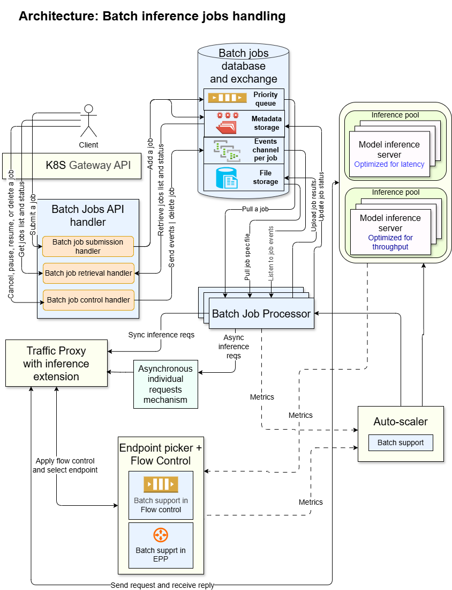

# Batch inference architecture

Jan 2026  
Revision 4

## Customer use cases

The use case is running asynchronously a set of inference requests which are grouped and tracked together in a job, where the completion of these inference requests is more time tolerant relative to interactive (time-sensitive) inference requests.  

The time tolerance for processing of interactive inference requests is typically on the scale of seconds and up to minutes.  
The time tolerance for processing batch jobs is typically on the scale of hours, for example 12 hours, 24 hours, 48 hours.

Example use cases include:  

- Inferencing a large dataset.
- Generating embeddings for large datasets.
- Evaluations of various types.
- Offline analysis of various types.

In systems that charge for inference requests - billing rates of batch inference requests may be different (typically lower) relative to the billing rates of interactive inference requests, due to the time tolerance.

## High level API requirements

The API should be compatible with [Batch API - OpenAI API](https://platform.openai.com/docs/guides/batch).  

1. The user submits a batch job that includes metadata and a reference to a jsonl file, where each line in the file specifies an independent inference request, that includes a model id, inference api, prompt, and inference parameters. The batch job metadata may include:
   - An SLO requirement, for example 24 hours. The SLO can be defined as a requirement for beginning processing or for completing processing.
   - A maximum charging threshold, and/or a maximum error threshold, where exceeding these thresholds would trigger stopping the job.
   - Retries policies.
   - Default or override inference parameter values on various levels, e.g. global, api type, model level.
1. The output of the inference requests is written to an output file and an error file, which the user can then retrieve / access. Responses are correlated to requests using a custom id.
1. It is possible to support multiple input files and multiple output files per job.
1. Users can list their batch jobs, track the status of their batch jobs, and can control their jobs, for example pause, resume, cancel or delete a job.

## High level system requirements

1. Process a large number of grouped inference requests in an asynchronous way.
1. Minimum interference to satisfying interactive requests SLOs.
1. Satisfy batch jobs’ SLOs.
1. When there is less interactive workload (enabling resource capacity) - increase the processing rate of batch workload, and when there is more interactive workload - decrease the processing rate of batch workload.
1. Control the flow of interactive and batch requests to maximize GPU utilization, minimize resource costs, and satisfy SLOs.
1. There may be different configurations of a model server to optimize for interactive workload (minimize token latency), and to optimize for batch workload (maximize throughput). If more than one configuration of a model server is used – optimize the usage and scaling of the various model replicas.
    1. One option is to use a single inference pool where the model servers are optimized for interactive. In this case this inference pool serves both interactive and batch workloads.
    1. Another option is to use 2 inference pools – one optimized for interactive and the second optimized for batch. In this case each inference pool serves its dedicated workload.
    1. Consider how this option can work with P/D disaggregation.
1. Auto-scaling considering batch workload:
    1. Consume metrics related to the batch workloads, in addition to other metrics.
    1. Scale the model servers based on current and expected interactive and batch workloads, and may also scale the component responsible for dispatching batch inference requests (see more details in the following).
1. Enable differential billing of batch requests versus interactive requests.
1. Fault-tolerance: Batch jobs will be processed and produce result files that users can retrieve, overcoming any crashes in batch processors or other system components, in a timely manner.
1. Apply optional consumption limits, such as:
    1. Per batch job:
        1. Max number of requests in the batch.
        1. Max size of the requests in the batch.
    1. Per user:
        1. Rate limit – max total number or total size of batch jobs per period.
    1. Per model server:
        1. Max number of concurrent batch requests.
    1. Plan to use Limitador.
        1. Consider that the rate limit database should serve multiple processes.

## Proposed architecture

### Components to support batch inference

1. Batch jobs API handler:
    1. A service that receives and processes API requests for batch inference jobs – submission, retrieval, and control of batch inference jobs.
    1. Routes in K8S GW will route these paths to the batch jobs API service.
    1. It will mainly interact with the data structures layer.
    1. It will expose API metrics.
1. Batch jobs data structures:
    1. Priority queue:
        1. Stores references to batch jobs ordered by priority.
        1. The ordering logic of the queue should be pluggable. The ordering can be based on a single numeric value that is calculated on each job via a plugin, or can be based on a given comparator. This logic can take into account various aspects, like SLO, size, etc.
            1. Specifically, calculate the priority value as a function of an SLO value of the job, for example the absolute time bound for starting or for completing the job.  
        1. It is also possible to have multiple queues if required, with a logic to pop jobs from these queues based on a pluggable inter-queue criteria.
    1. Metadata storage:
        1. Stores the metadata of batch jobs.
        1. Enables to efficiently:
            1. Update the status of a job.
            1. Retrieve the status of one or more jobs, selected with customizable criteria.
            1. Retain the metadata of batch jobs for a duration scale of months for a large number of jobs.
    1. Event channels:
        1. An event channel is opened dynamically for every jobs which processing is starting, and it closes when the job processing is complete.
        1. The channel enables any api call to control the job (cancel, pause) by sending an appropriate event to the batch processor instance that is processing the job.
    1. File storage:
        1. Stores and enables to access a batch job’s input file, that specifies the batch inference requests.
        1. Enables to write a results file for a batch job, that includes the inference results.
    1. All the above data structures should support different storage systems in a pluggable way.
1. Batch job processor:
    1. Pulls jobs from the data structures, and processes these, by calling the traffic proxy with individual inference requests from the batch.
    1. Creates and writes job result files.
    1. May sort and/or group requests in ways that increase the efficiency of processing. May send additional metadata with individual inference requests, where the metadata aims to help downstream components to increase the efficiency of processing the requests. Examples: group by model and inference endpoint; group by prompt similarity (and send metadata representing the similarity cluster centroid id).
    1. Throttles the number or size of concurrently dispatched inference requests, based on configuration and possibly job properties. Example logic: closer SLO is associated with a larger concurrency max.
    1. Sends individual batch requests either synchronously or asynchronously (configurable) to the traffic proxy.
    1. Should map each model to an appropriate inference pool.
    1. Updates job status. Provides a progress indicator, for example how many requests processed from the total number of requests in the job.
    1. Listens to job events (e.g. cancel, pause).
    1. Each batch processor may process multiple jobs concurrency via concurrent workers.
    1. Handles recovery from crashed processors. Possibly uses a checkpointing mechanism to resume from the last checkpoint.
    1. Generate metrics, also for usage by the auto-scaler.
1. Flow control:
    1. Should provide an inter flow policy to support batch inference. The policy would be generic, and supporting batch / interactive can be a private case of using the policy.
    1. Enables to set different flow identifiers (and priorities) for batch and for interactive workloads, and process these using an appropriate inter flow policy that satisfies the aforementioned requirements. This is assuming a single inference pool is used for both interactive and batch.
    1. Generates metrics, also for usage by the auto-scaler.
1. Endpoint picker:
    1. May be aware of metadata information (hints) sent by the batch processor with inference request. For example hints related to kv-cache optimization.
1. Auto-scaler:
    1. Consumes metrics related to batch inference, in addition to all other metrics, and scales model servers and possibly batch processors accordingly. For example, first priority can be to scale model servers, and second priority can be to scale batch processors.

## References

1. https://platform.openai.com/docs/guides/batch
1. https://docs.anthropic.com/en/docs/build-with-claude/batch-processing
1. https://docs.google.com/document/d/1notkq9s0qOmWmUNonZ8CfI-5jtGtHA4PGMI-xz8sGRE/edit?tab=t.0#heading=h.i76kzr3j3swj – Focuses on a mechanism that enables to submit and track individual asynchronous requests. The current document focuses on handling batch jobs, where each job specifies a file that consists of multiple individual requests and the output is stored in a file. The current document focuses on the batch jobs API handler and on the batch processor that processes a specification file. The batch processor can submit individual requests using the asynchronous mechanism specified in the referenced document.
